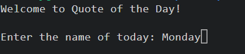
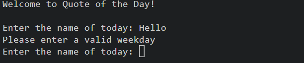
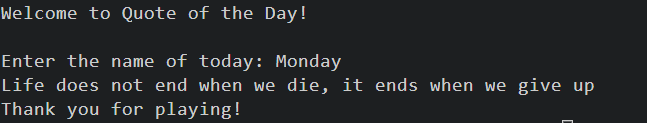

# Quote of the Day

Do you feel down sometimes? Need some motivation? Try the "Quote of the Day" service. 
Enter the name of today and see what will be your quote of the day. The purpose behind it is to make someones day a bit brighter. 

  

## How to play

When entering the game it will greet you with "Welcome to the Quote of the Day". 

When starting the service it will ask you for the name of today. 

Enter the name of today and a random quote will appear on screen.  

If not a valid day is inserted the game will run until a correct weekday is inserted. 

When a day has been inserted the game will deliver a quote.

In the end the game thanks you for playing. 
 

## Features
-----------------------------------------------------------------------------------------------------------------

The features included in the game are essential for a functioning game. 

- Feature 1: The welcome_quote_of_the_day function

To greet the player, the welcome_quote_of_the_day function delivers the string "Welcome to the Quote of the Day" when the application is run. 

  

- Feature 2: The check_input function 

The check input function has a string that calls to action. The string is 'Enter the name of today:'. This very easily tells the user what is expected to play the game. It will run until the correct weekday is inserted. 

s

- Feature 3: The display_random_quote function 

The display_random_quote function gets a random quote out of quote_list and presents it. This is the most important feature in the game. This is where the "feel-good feeling" is meant to come. 

- Feature 4: The end_game function 

The end_game function ends the game when a correct day is inserted. It ends the game with the string "Thank you for playing!". 

### Data Model
------------------------------------------------------------------------------------------------------------------

This game uses list, functions and control flow. 

- 1 : List

The quote_list is a list data structure that stores a collection of quotes. Each quote is represented as a string element within the list. This list serves as a data collection for random quotes in the game. The inputs_list is another list that stores valid weekdays. It is used in the check_input function to validate user input against a predefined list of valid values.

- 2 : Functions
The code uses functions to organize the logic. Functions like welcome_quote_of_the_day, check_input, display_random_quote, game_end, and main help structure the program's behavior.

- 3 : Control Flow

The game uses a while loop in the main function to repeatedly ask the user for input until valid input is provided. This control flow, along with functions and data structures, helps manage the program's flow and interactions.

#### Testing
-----------------------------------------------------------------------------------------------------------------

I have manually tested this project by doing the following: 

- Passed the code through a PEP8 linter and confirmed that there are no  problems.
- Given invalid inputs to test if assigned function works. 
- Tested in my local terminal and the Code Instistute Heroku Terminal. 

- ##### BUGS
At first I choose the define the quotes by a letter and then assigning each letter with a quote. However for better readibility I later choose to have the quotes in a list without a letter assigned. 

 - ##### UNSOLVED BUGS
 There are no unsolved bugs. 

  - ##### VALIDATOR TESTING 
  No errors where returned from https://pep8ci.herokuapp.com/

 
#### Deployment
-----------------------------------------------------------------------------------------------------------------
This project was deployed using Code Institute`s mock terminal for Heroku.

- Steps for deployment.
1. Fork or clone this repository.
2. Create a new heroku app. 
3. Set the buildbacks to Python and NodeJS in that order. 
4. Link the Heroku App to the repository.
5. Klick in deploy. 

#### Credits
-----------------------------------------------------------------------------------------------------------------

The quotes in this project belongs to several known and unknown authors and was taken from https://www.oberlo.com/blog/motivational-quotes

The code in this project is inspired of the Love Sandwiches project, 
https://github.com/Pelikantapeten/p3-dad-jokes/blob/main/run.py,
https://hackr.io/blog/python-projects Number Guessing.

The idé to this project I got from the https://github.com/Pelikantapeten/p3-dad-jokes/blob/main/run.py.
How to structure it I got from https://hackr.io/blog/python-projects. In particularly the "Number Guessing" game. The website hosted a lot of simple games i Python and there was something useful in almost all of them. 
To check my code and execution I have reilied on https://pythontutor.com/python-debugger.html#mode=edit.
Throughout the project I have also used forums like https://www.w3schools.com/python/python_while_loops.asp, https://stackoverflow.com/ and https://geeksforgeeks.org/ for structuring functions, while loop and if/else statement. 

